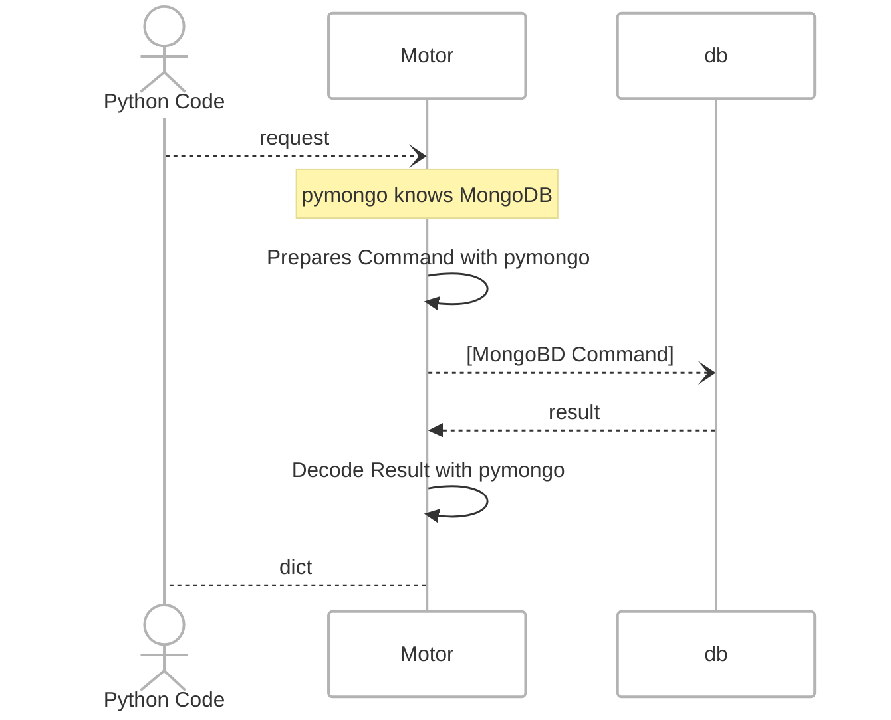

# Data How You Want It

Python + MongoDB, Async API over data in MongoDB.

A demo of using `pymongo`,  `motor`(`asyncio`), `fastapi`, `pydantic` to manipulate document data in MongoDB.

Points to consider:

1. Async interface, from `FastAPI` to `motor` - for scale and concurrency.
1. `motor` uses `pymongo`.
1.`_id` using natural key vs. opaque ObjectId
1. Slam replace to update vs. `$push` to append data so that existing data isn't lost
1. Largely built-in pymongo codec: Python type mappings conver to/from BSON.
1. Using Pydantic for model validation. This can also be re-enforced as a collection validator.
1. (primitive HTTP api routing, using for activation)

## Slides

Slide [deck for pycon 2025](./slides-pycon2025.md), use [Marp](//marp.app) to render.

## Aside

1. Use [Silent demo](aside/demo_silent.py) while monitoring MongoDB server to see no connection is open before issuing command.
1. See [Cursor demo](aside/demo_cursor.py) for async cursor iteration.
1. See [mdb](app/mdb.py) for direct usage of MongoDB  using `pymongo` via `asyncio`'s `AsyncIOMotorClient`. No ORM/ODM needed.
1. See [models](app/models.py) for `Pydantic` model wrappers, establishing shape and content, allowing validatin of schema
1. See [Main](app/main.py) for `FastAPI` setup (inline, no fancy routing)

## Diagraming

Diagrams generated with `mermaidjs` for illustration only. 

Example component sequence concept:

Example pydantic mapping concept:

