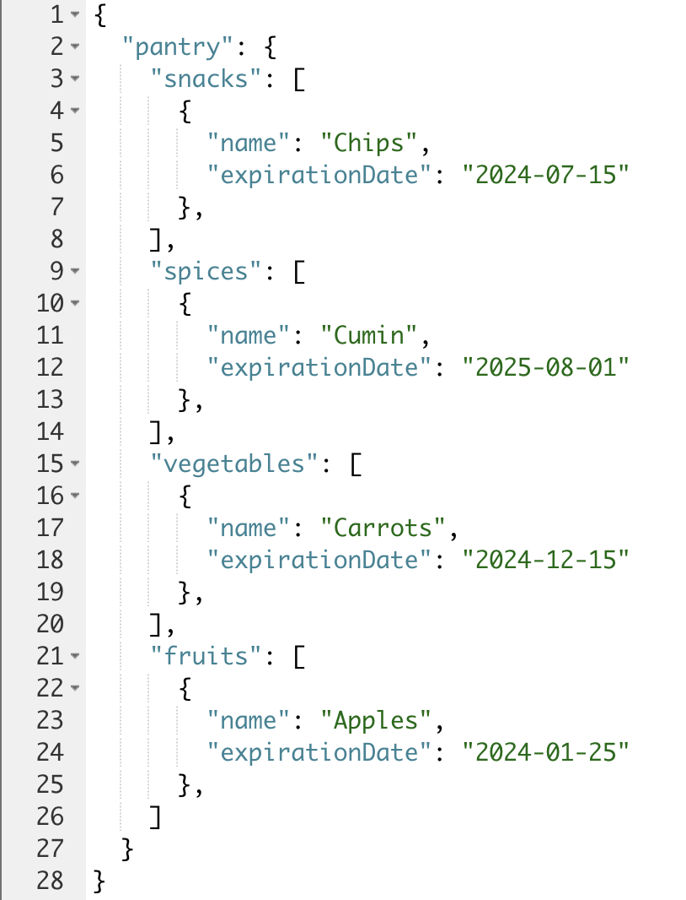
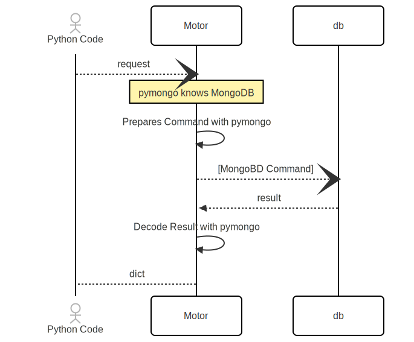
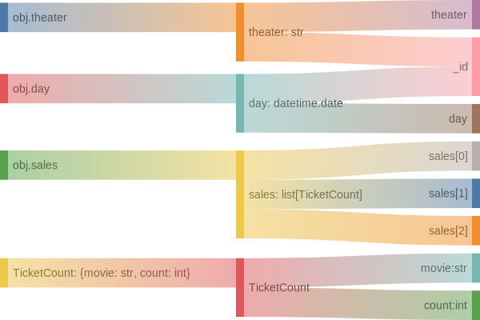

<!-- _paginate: skip -->
# Data How You Want It

> pymongo + MongoDB == your_data_backend

```python
discussion_topics = ('MongoDB', 'pymongo', 'AsyncIOMotorClient', 'FastAPI')
```

Nuri Halperin | PyCon 2025


---

## What's Up, Doc?

MongoDB stores documents. Documents are self describing representation of your data.

```json
{
  "theater": "Aero",
    "day": { "$date": "2025-01-01" },
    "sales": [
      { "movie": "Elf", "tickets_sold": 111 },
      { "movie": "Die Hard", "tickets_sold": 222 }
    ]
  }
```

_This document was designed to store the number of tickets sold for a movie in a theater on a certain day._



---

## BSON ~= JSON

JSON is nice, but skimps on native data types.

Field| BSON Data Type | Python (in demo)
:-- |:-- |:--
`theater` | **UTF-8 String** | `str`
`day` | **UTC Datetime** | `datetime.date`
`sales` | **Array** | `list`
`sales` | **Array** | `list`
`movie` | **UTF-8 String** | `str`
`tickets_sold` | **32-bit integer** | `int`

---

## PyMongo + Motor



---

## Diving In


- Instantiation scope
- "Connect"
- "Namespace"

---

## Once, Before All


```python
from motor.motor_asyncio import AsyncIOMotorClient

CONNECTION_STRING = os.environ.get("MY_MONGODB_URI", "mongodb://localhost/demo")
```

> Instantiate

```python
client = AsyncIOMotorClient(CONNECTION_STRING)
db = client.get_default_database()
```

> Do something...

```python
c1 = db.stuff1

# c2 = db.get_collection("stuff1")
```

---

## Read A Doc


```python

async def get_one_theater_sales(day: date, theater: str):
    """Get the sales for a single day."""

    filter = {"_id": f"{day}_{theater.lower().replace(' ','_')}"}
    
    doc = await db.theater_sales.find_one(filter)
    return doc if doc else None
```

> `find_one()` returns one document matching criteria.
---
<!-- _backgroundColor: hsl(0, 100%, 64%) -->

## Writing - (Dangerously)

```python
await collection.update_one(
    {"_id": data.id},
    {
        "$set": {
            "sales": sales, # a list of sales
            "theater":data.theater,
            "day": date_to_datetime(data.day),
        }
    },
    upsert=True,
)
```
<!-- The danger is that sales array gets replaced completely. Previous elements gone -->
---

## Writing Respecfully

```python
await db.theater_sales.update_one(
    {"_id": data.id},
    {
        "$set": {"theater": data.theater, "day": date_to_datetime(data.day)},
        "$push": {"sales": {"$each": [m.model_dump() for m in data.sales]}},
    },
    upsert=True,
)
```

* Previous elements of the `sales` field survive
<!-- This write respects existing array elements -->
---

## Aggregate - Read More Docs

```python
async def multi_day_sales(on_or_after: date, before: date, *breakdown: str):
    filter = date_filter(on_or_after, before)
    unwind = unpivot_sales()
    group = group_by(breakdown)
    flatten = flatten_id()
    pipeline = [filter, unwind, group, flatten]

    return await db.theater_sales.aggregate(pipeline).to_list(None)
```

> pymongo **cursor** can be iterated, and hides batching details

---

## Pyadantically

```python
class TheaterSales(BaseModel):
    theater: str
    day: datetime.date
    sales: list[TicketCount] = []

    @computed_field(alias="_id")
    @property
    def id(self) -> str:
        return create_id(self.theater, self.day)

    model_config = {
        "json_schema_extra": { }
    }
```



---
## Fast?


- FastAPI: Use for high performance, async API
- Pydantic: Validate dict / doc
- Async: motor and asyncio manage concurrency
- MongoDB: Sharding, indexes, natively document oriented

---

## Resources


1. [`pymongo`](//pymongo.readthedocs.io/en/stable/) **pymongo.readthedocs.io**/en/stable/
1. [`motor`](//motor.readthedocs.io/en/stable/) **motor.readthedocs.io**/en/stable/
1. [`fastapi`](//fastapi.tiangolo.com/) **fastapi.tiangolo.com**/
1. [MongoDB Community Champions](//www.mongodb.com/community/champions/) **mongodb.com**/community/champions
